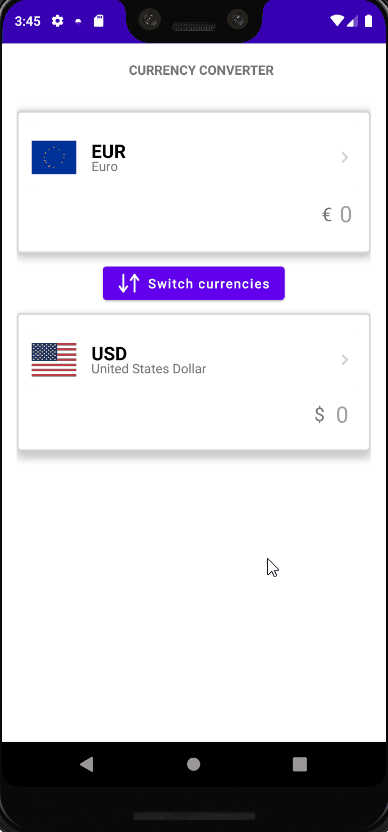

## ExchangeRates

Currency exchange app using the [Exchange rates API](https://exchangeratesapi.io/)

* MVVM architecture
* Navigation - single activity approach and fragments for destinations, safeargs for passing parameters
* StateFlow + Coroutines
* ViewBinding
* Dagger-Hilt dependency injection
* Retrofit2

## Demo

